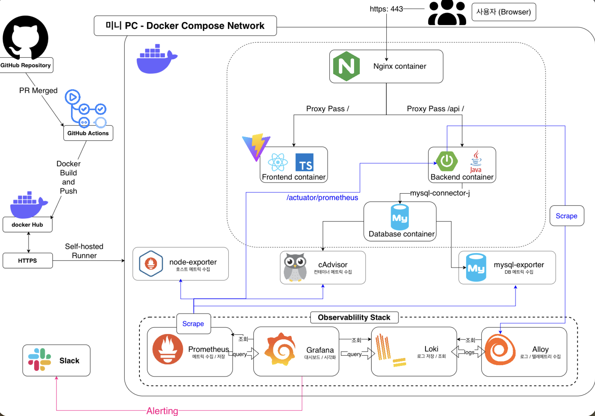
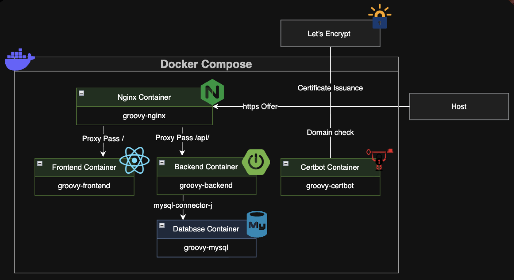
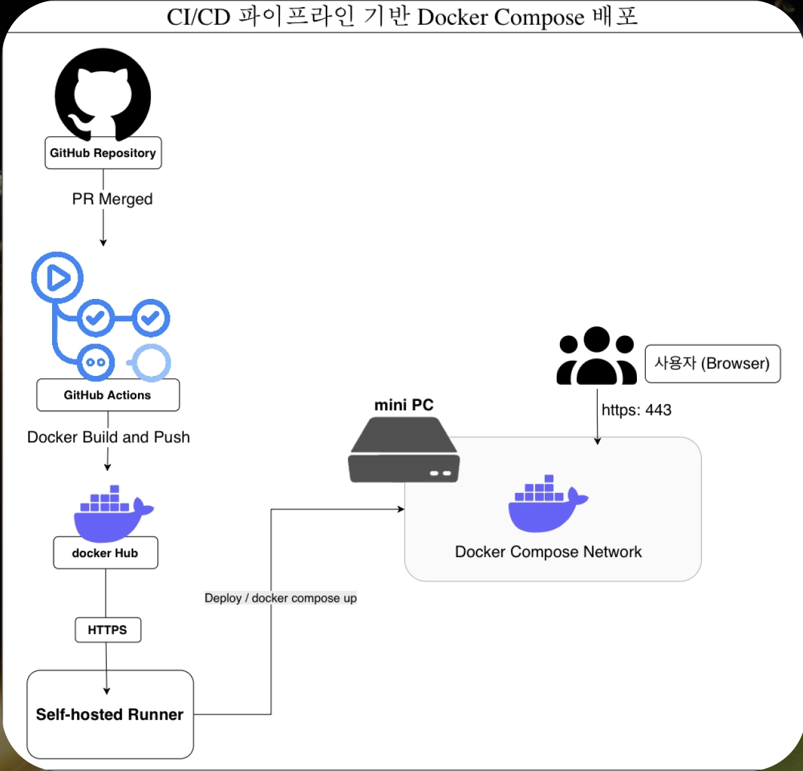
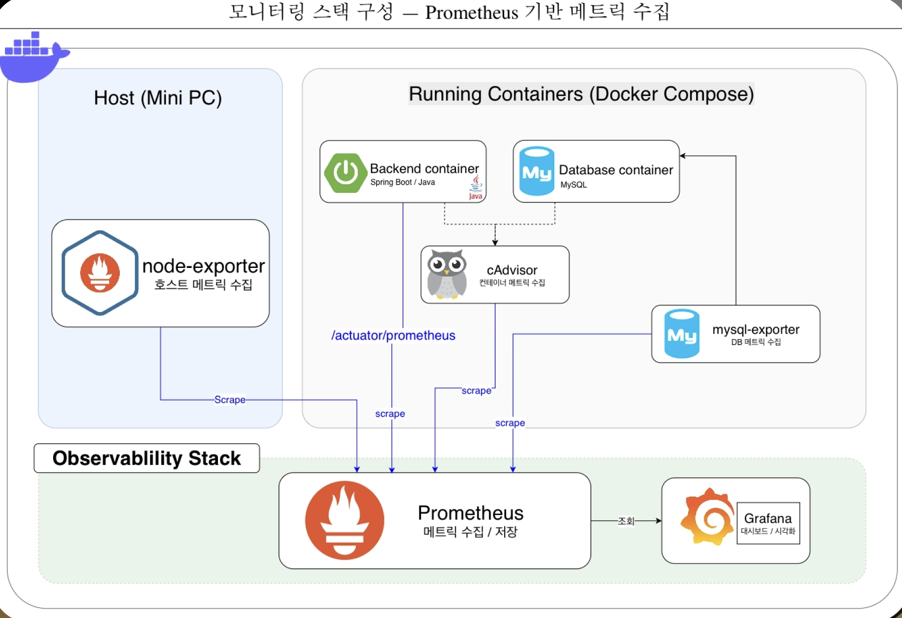

# Groovy

KT Cloud Native: Team 이륙(26)의 Groovy 프로젝트 레포지토리입니다.


---

## 1. 프로젝트 소개

**Groovy**는 태그 기반으로 스터디 그룹을 매칭하고, 참여 신청/승인, 캘린더 일정 관리, 회고록(게시글) 공유, 실시간 알림까지 지원하는 스터디 커뮤니티 플랫폼입니다.

- 스터디 그룹 생성·매칭·참여 신청/승인·대기열
- 스터디 회고록(게시글) 작성, 댓글, 좋아요
- 개인/스터디 통합 캘린더
- 태그 기반 취향 매칭
- SSE 기반 실시간 알림

백엔드(Spring Boot)와 프론트엔드(React)를 하나의 저장소에서 관리하는 모노레포 구조이며, Docker Compose 기반 인프라와 Prometheus/Grafana/Loki 모니터링 스택을 함께 운영합니다.


## 2. 개발 워크플로우

### Git Flow 전략

- **`main`**: 실제 배포되는 최종 안정 버전. 코드 리뷰를 통과한 코드만 병합됩니다.
- **`dev`**: 다음 배포를 위한 개발 통합 브랜치. 모든 기능 브랜치의 출발점이자 종착지입니다.
- **기능 브랜치(`feat/`, `fix/` 등)**: 개별 작업을 독립적으로 수행합니다.

```
[ 이슈 생성 ] → [ dev에서 브랜치 생성 ] → [ 기능 개발 & 커밋 ]
                                                ↓
[ main 병합 ] ← [ 코드 리뷰 & Merge ] ← [ dev로 PR 생성 ] ← [ Remote Push ]
```


## 3. 주요 기능

- **회원**: 
    - 회원가입 / 로그인 / 로그아웃(JWT), 마이페이지, `USER`/`ADMIN` 권한 구분
- **스터디**: 
    - 스터디 그룹 CRUD, 참여 신청/승인/거절, 정원 초과 시 대기열 자동 승격, 레벨/경험치 시스템
- **회고록**: 
    - 스터디 회고(게시글) CRUD, 댓글, 좋아요
- **캘린더**: 
    - 개인 일정과 스터디 공식 일정 통합 조회
- **태그**: 
    - 태그 목록 조회, 선호 태그 설정, 태그 기반 스터디 매칭 추천
- **알림**: 
    - SSE 실시간 알림 구독, 읽음 처리(단건/전체), 신청·승인·댓글·좋아요·레벨업·일정변경·대기열좌석 등 이벤트 기반 알림, 만료 알림 자동 정리

## 4. 시스템 아키텍처




## 5. 기술 스택



### 백엔드

| 카테고리 | 기술 | 비고 |
| :--- | :--- | :--- |
| Language | Java 21 | |
| Framework | Spring Boot 4.1.0 | |
| Build Tool | Gradle | |
| Data Access | Spring Data JPA | MySQL |
| DB Migration | Flyway | |
| Cache / Pub-Sub | Spring Data Redis | SSE 브로드캐스트, 구독 티켓 |
| Security | Spring Security + JWT (jjwt 0.12.6) | |
| Validation | spring-boot-starter-validation | |
| Observability | Actuator + Micrometer (Prometheus) | |
| Logging | logstash-logback-encoder | JSON 구조화 로그 → Loki |
| 기타 | Lombok | |
| Test | JUnit5, spring-security-test, data-jpa-test, webmvc-test | |

### 프론트엔드

| 카테고리 | 기술 | 비고 |
| :--- | :--- | :--- |
| Framework | React 19 | |
| Routing | react-router-dom | `createBrowserRouter` |
| Build Tool | Vite | |
| Language | TypeScript | |
| Lint | oxlint | |
| 상태관리 | React Context API | 별도 라이브러리 미사용 |
| HTTP Client | 자체 `fetch` 래퍼 | axios 미사용 |
| Markdown | react-markdown, remark-gfm | |


## 6. 프로젝트 구조

```
Groovy/
├── groovy/                                # 백엔드 (Spring Boot)
│   ├── src/main/java/com/groovy/backend/
│   │   ├── common/                        # BaseTimeEntity, ApiResponse, HealthCheck
│   │   ├── global/                        # auth(JWT), config, exception
│   │   └── domain/
│   │       ├── user/                      # 회원
│   │       ├── study/                     # 스터디, 신청, 대기열
│   │       ├── memoir/                    # 회고록, 댓글, 좋아요
│   │       ├── calendar/                  # 캘린더
│   │       ├── notification/              # SSE 알림
│   │       └── tag/                       # 태그
│   ├── src/main/resources/db/migration/   # Flyway 마이그레이션 (V1~V8)
│   ├── src/test/                          # 테스트 코드
│   ├── docs/agents.md                     # 아키텍처 원칙 / API 명세 문서
│   ├── docker-compose.yml                 # 백엔드 단독 배포용
│   ├── docker-compose.local.yml           # 백엔드 단독 로컬용
│   ├── deploy.sh
│   └── build.gradle
├── front/                                 # 프론트엔드 (React + Vite)
│   └── src/
│       ├── api/                           # 도메인별 API 클라이언트
│       ├── components/
│       ├── context/                       # AuthContext, NotificationContext
│       ├── pages/
│       ├── utils/
│       └── routes.tsx
├── nginx/nginx.conf                       # 리버스 프록시 설정
├── alertmanager/alertmanager.yml
├── prometheus/                            # prometheus.yml, alert.rules.yml
├── monitoring/                            # loki, alloy, grafana provisioning
├── docker-compose.yml                     # 로컬 통합 개발용
├── docker-compose.prod.yml                # 운영 배포용
└── .github/workflows/                     # 백엔드/프론트 build&push + deploy
```


## 7. 애플리케이션 아키텍처


- **레이어드 아키텍처**: 
    - `Controller → Service(@Transactional) → Repository(Spring Data JPA) → Entity`
- **공통 응답 포맷**: 
    - 모든 API가 `ApiResponse<T>(status, message, data)`로 응답을 래핑합니다.
- **전역 예외 처리**: 
    - `@RestControllerAdvice` 기반 `GlobalExceptionHandler`가 검증 오류(400), 권한 오류(403), 그 외 예외(500)를 일괄 처리합니다.
- **무상태 + 가상 스레드**: 
    - 세션을 사용하지 않으며 `spring.threads.virtual.enabled: true`로 가상 스레드를 활용합니다.


### 동시성 제어

스터디 정원의 마지막 자리를 두고 여러 요청이 몰릴 수 있는 상황(참여 승인/탈퇴/정원 변경)에 대해 `@Lock(PESSIMISTIC_WRITE)` 비관적 락을 적용하고, 정원이 가득 찬 경우 대기열(Waitlist)에 등록해 자리가 열리면 순차적으로 알림을 보냅니다. 이 로직은 `ConcurrencyTest`로 별도 검증됩니다.

## 8. 인프라 및 배포 구조

| 파일 | 용도 |
| :--- | :--- |
| 루트 `docker-compose.yml` | 로컬 통합 개발 (소스 빌드, nginx 없음) |
| 루트 `docker-compose.prod.yml` | 운영 배포 (Docker Hub 프리빌트 이미지, nginx + certbot + Loki/Alloy 포함) |


- **백엔드 Dockerfile**: 
    - JDK 21 빌드 → JRE 21 런타임 멀티스테이지, 비root 유저로 실행, `/api/health` HEALTHCHECK 내장
- **프론트 Dockerfile**: 
    - Node 22 기반으로 `vite build` 후 `serve`로 정적 서빙. `VITE_API_BASE_URL`은 Vite 특성상 빌드타임 `ARG`로 주입되므로, API 주소가 바뀌면 이미지를 다시 빌드해야 합니다.

## 9. CI/CD



`.github/workflows/docker-build-push-backend.yml`, `docker-build-push-frontend.yml`이 대칭 구조로 존재합니다.

- **트리거**: 
    - `main` 브랜치에 각각 `groovy/**` / `front/**` 변경이 포함된 push 발생 시(+ 수동 실행)
- **빌드**: 
    - `docker/build-push-action`으로 Docker Hub(`bebeghi/*`)에 `latest`, `observability-v1`, `${{ github.sha }}` 3개 태그로 이미지 push
- **배포**: 
    - `runs-on: self-hosted` deploy job이 `concurrency` 그룹으로 배포를 직렬화하며, 운영 서버에서 `docker compose -f docker-compose.prod.yml pull && up -d --remove-orphans`를 실행


## 10. 모니터링 및 Observability



- **Prometheus**: 
    - `/actuator/prometheus`를 15초 주기로 스크래핑하고, 운영 환경에서는 mysqld-exporter / cAdvisor / node-exporter도 함께 수집합니다.
- **Alertmanager**: 
    - 알림 규칙 발생 시 Slack `#grafana-alert` 채널로 웹훅 전송합니다.
- **Grafana**: 
    - JVM(Micrometer) 대시보드와 Backend 로그(Loki) 대시보드가 자동 프로비저닝됩니다.
- **Loki + Alloy**: 
    - Alloy가 `docker.sock`을 통해 모든 컨테이너의 stdout/stderr 로그를 자동 수집하여 Loki로 전송합니다. 애플리케이션 코드 수정 없이 컨테이너 로그 자체를 수집하는 구조입니다.
- **cAdvisor / node-exporter**: 
    - 각각 컨테이너 단위 리소스 지표와 호스트 OS 지표를 수집합니다.


## 11. 로컬 실행 방법

### 전체 스택 (프론트 + 백엔드 + DB + 모니터링)

```bash
cp groovy/.env.example groovy/.env   # 값 채우기
docker compose up -d --build
```

- 프론트: http://localhost:5173
- 백엔드: http://localhost:8080
- Grafana: http://localhost:3000
- Prometheus: http://localhost:9091
- Alertmanager: http://localhost:9093

### 백엔드만 컨테이너로 실행

```bash
cd groovy
cp .env.example .env
./deploy.sh          # 정지: ./deploy.sh down, 로그: ./deploy.sh logs
```

### 백엔드를 로컬 JVM/IDE로 실행 (DB만 컨테이너)

```bash
cd groovy
docker compose -f docker-compose.local.yml up -d mysql redis
./gradlew bootRun
```

### 프론트엔드만 개발 서버로 실행

```bash
cd front
npm ci
npm run dev
```

> `.env`는 `.gitignore` 대상이므로 각 `.env.example`을 기준으로 직접 생성해야 합니다. Alertmanager를 함께 띄우려면 `alertmanager/slack_webhook_url` 파일도 별도로 준비해야 합니다.

## 12. 환경변수 및 Configuration

아래 값은 실제 시크릿이 아닌 더미 예시입니다. 실제 값은 각자의 `.env` 파일에 설정하세요.

### 데이터베이스 
######   (환경 변수 값은 실제값이 아닌 예시입니다)

| 변수명 | 용도 | 예시 |
| :--- | :--- | :--- |
| `MYSQL_DATABASE` | MySQL 데이터베이스명 | `groovy_db` |
| `MYSQL_ROOT_PASSWORD` | MySQL root 비밀번호 | `your_mysql_password_here` |
| `SPRING_DEV_DB_URL` | Spring datasource URL | `jdbc:mysql://localhost:3306/groovy_db?useSSL=false&allowPublicKeyRetrieval=true&serverTimezone=Asia/Seoul` |
| `SPRING_DEV_DB_USERNAME` | DB 사용자명 | `root` |
| `SPRING_DEV_DB_PASSWORD` | DB 비밀번호 | `your_mysql_password_here` |
| `DB_POOL_MAX_SIZE` | HikariCP 최대 커넥션 수 | `30` |
| `DB_POOL_MIN_IDLE` | HikariCP 최소 유휴 커넥션 수 | `10` |

### 인증

| 변수명 | 용도 | 예시 |
| :--- | :--- | :--- |
| `JWT_SECRET_KEY` | JWT 서명 키 (32byte 이상 권장) | `change-me-to-a-random-base64-secret-of-at-least-32-bytes` |

### Redis

| 변수명 | 용도 | 예시 |
| :--- | :--- | :--- |
| `REDIS_HOST` | Redis 호스트 | `redis` |
| `REDIS_PORT` | Redis 포트 | `6379` |

### 서버 / CORS

| 변수명 | 용도 | 예시 |
| :--- | :--- | :--- |
| `SERVER_PORT` | 백엔드 노출 포트 | `8080` |
| `CORS_ALLOWED_ORIGINS` | 허용 프론트 origin (콤마 구분) | `http://localhost:5173` |

### 프론트엔드

| 변수명 | 용도 | 예시 |
| :--- | :--- | :--- |
| `VITE_API_BASE_URL` | 프론트가 호출할 백엔드 API 주소 | `http://localhost:8080` |

### 모니터링

| 변수명 | 용도 | 예시 |
| :--- | :--- | :--- |
| `GRAFANA_ADMIN_USER` | Grafana 관리자 계정 | `admin` |
| `GRAFANA_ADMIN_PASSWORD` | Grafana 관리자 비밀번호 | `change-me-admin-password` |
| `GRAFANA_PORT` | Grafana 노출 포트 | `3000` |
| `MYSQLD_EXPORTER_PASSWORD` | mysqld-exporter 접속 비밀번호 | `your_mysql_password_here` |

## 13. 데이터베이스

- **DBMS**: 
    - MySQL 8.0 (HikariCP, `ddl-auto: validate`)
- **마이그레이션**: 
    - Flyway, `src/main/resources/db/migration`에 V1~V8 순차 적용 
    - baseline_schema → calendar 컬럼 정리 → memoir 테이블 → memoir_likes → calendar content → notifications → study_waitlists → notification read_at

- **ORM**: 
    - Spring Data JPA (`@Query` 기반, QueryDSL 미사용)
- **Redis 활용처**: 
    - SSE 알림의 다중 인스턴스 Pub/Sub 브로드캐스트, SSE 구독용 1회성 티켓(TTL 30초) 저장
- **동시성 제어**: 
    - `StudyRepository.findByIdForUpdate`에 `@Lock(PESSIMISTIC_WRITE)` 적용

### ERD 요약

```
User ─┬─< Study(leader) ─┬─< Calendar / Memoir / Application / StudyWaitlist / StudyTag
      ├─< Calendar(personal)
      ├─< Memoir ─┬─< MemoirComment
      │           └─< MemoirLike
      ├─< Application / StudyWaitlist
      ├─< Notification
      └─< UserTag >─ Tag ─< StudyTag
```

모든 엔티티는 `BaseTimeEntity`(createdAt / updatedAt)를 상속하며, `Study`는 자체 레벨/경험치 시스템을 갖고 있습니다.

## 14. API 문서

### Auth `/api/auth`

| Method | Path | 설명 |
| :--- | :--- | :--- |
| POST | `/signup` | 회원가입 |
| POST | `/login` | 로그인, JWT 발급 |
| POST | `/logout` | 로그아웃 |

### User `/api/users` (인증 필요)

| Method | Path | 설명 |
| :--- | :--- | :--- |
| GET | `/me` | 내 정보 조회 |
| GET | `/me/studies` | 내가 만든 스터디 목록 |
| GET | `/me/applications` | 내 신청/참여 내역 |

### Study `/api/studies`

| Method | Path | 설명 |
| :--- | :--- | :--- |
| POST | `` | 스터디 생성 |
| GET | `` | 스터디 목록 조회(페이징) |
| GET | `/{studyId}` | 스터디 상세 조회 |
| GET | `/match` | 태그 기반 매칭 스터디 조회 |
| PUT | `/{studyId}` | 스터디 수정 |
| DELETE | `/{studyId}` | 스터디 삭제 |
| DELETE | `/{studyId}/membership` | 스터디 탈퇴 |

### Application `/api/studies/{studyId}/applications` (인증 필요)

| Method | Path | 설명 |
| :--- | :--- | :--- |
| POST | `` | 참여 신청 |
| DELETE | `` | 신청 취소 |
| GET | `` | 신청 목록 조회(방장용) |
| PATCH | `/{applicationId}` | 신청 승인/거절 처리 |

### Waitlist `/api/studies/{studyId}/waitlist` (인증 필요)

| Method | Path | 설명 |
| :--- | :--- | :--- |
| POST | `` | 빈자리 알림 등록 |
| DELETE | `` | 빈자리 알림 취소 |

### Memoir `/api/memoirs`

| Method | Path | 설명 |
| :--- | :--- | :--- |
| POST | `` | 회고록 작성 |
| GET | `` | 회고록 목록 조회(검색/정렬/페이징) |
| GET | `/my-studies` | 회고록 작성 가능한 내 스터디 목록 |
| GET | `/mine` | 내가 쓴 회고록 목록 |
| GET | `/{memoirId}` | 회고록 상세 조회 |
| PUT | `/{memoirId}` | 회고록 수정 |
| DELETE | `/{memoirId}` | 회고록 삭제 |
| POST | `/{memoirId}/likes` | 좋아요 |
| DELETE | `/{memoirId}/likes` | 좋아요 취소 |

### MemoirComment `/api/memoirs/{memoirId}/comments`

| Method | Path | 설명 |
| :--- | :--- | :--- |
| GET | `` | 댓글 목록 조회 |
| POST | `` | 댓글 작성 |
| PUT | `/{commentId}` | 댓글 수정 |
| DELETE | `/{commentId}` | 댓글 삭제 |

### Calendar `/api/calendars` (인증 필요)

| Method | Path | 설명 |
| :--- | :--- | :--- |
| GET | `` | 개인+스터디 통합 일정 조회 |
| GET | `/studies` | 일정 등록 가능한 내 스터디 목록 |
| POST | `` | 일정 추가 |
| GET | `/{id}` | 일정 상세 조회 |
| PUT | `/{id}` | 일정 수정 |
| DELETE | `/{id}` | 일정 삭제 |

### Notification `/api/notifications`

| Method | Path | 설명 |
| :--- | :--- | :--- |
| GET | `` | 안읽은 알림 목록 조회(인증 필요) |
| POST | `/{id}/read` | 알림 읽음 처리(인증 필요) |
| POST | `/read-all` | 전체 읽음 처리(인증 필요) |
| POST | `/subscribe-ticket` | SSE 구독 티켓 발급(인증 필요) |
| GET | `/subscribe` | SSE 알림 구독 연결 |

### Tag `/api/tags`

| Method | Path | 설명 |
| :--- | :--- | :--- |
| GET | `` | 전체 태그 목록 조회 |
| GET | `/me` | 내 선호 태그 조회(인증 필요) |
| PUT | `/me` | 내 선호 태그 저장(인증 필요) |

### Health

| Method | Path | 설명 |
| :--- | :--- | :--- |
| GET | `/api/health` | 헬스체크 |


## 15. 장애 대응 / 운영 정책

- **알림 채널**: 
    - Alertmanager가 발생한 모든 알림을 Slack `#grafana-alert` 채널로 전송합니다. 현재는 역할/심각도별 라우팅 분기 없이 단일 채널로 운영됩니다.
- **배포 정책**: 
    - `main` 브랜치 push 시 별도 승인 절차 없이 self-hosted runner를 통해 운영 서버에 즉시 배포됩니다. 별도 스테이징 환경은 없으며, 필요 시 Docker Hub의 커밋 SHA 태그 이미지로 특정 시점 재배포가 가능합니다.
- **다운타임**: 
    - 백엔드가 단일 인스턴스로 운영되어 재배포 시 수 초간의 다운타임이 발생할 수 있습니다. 무중단 배포는 아직 지원하지 않습니다.
- **동시성 장애 예방**: 
    - 스터디 정원 초과와 같은 경쟁 상태는 비관적 락과 대기열로 사전에 차단합니다.
- **데이터 정리**: 
    - 만료된 알림은 스케줄러(`NotificationCleanupScheduler`)가 주기적으로 자동 삭제합니다.


## 16. 주요 기술적 의사결정

1. **SSE 알림 + 비관적 락 + 대기열**: 
    - 스터디 정원 동시성 문제를 비관적 락과 대기열로 해결하고, 관련 이벤트를 SSE로 실시간 전달하는 구조를 채택했습니다.
2. **Flyway 마이그레이션 도입**: 
    - `ddl-auto` 자동 스키마 생성 대신 Flyway로 스키마 변경을 버전 관리하도록 전환했습니다.
3. **Observability 스택 단계적 구축**: 
    - Prometheus → Grafana → Loki+Alloy → cAdvisor → mysqld-exporter → node-exporter → Alertmanager 순으로 점진적으로 모니터링 범위를 확장했습니다.
4. **CI 러너 전환**: 
    - GitHub-hosted runner에서 self-hosted runner로 전환해 22번 포트를 닫고 빌드/배포 성능과 비용을 개선했습니다.
5. **CI/CD 파이프라인 분리**: 
    - 모노레포 내에서 프론트/백엔드의 빌드·배포 워크플로우를 독립적으로 분리했습니다.
6. **HTTPS 자동화**: 
    - Let's Encrypt(certbot)로 인증서 발급/갱신을 자동화했습니다.