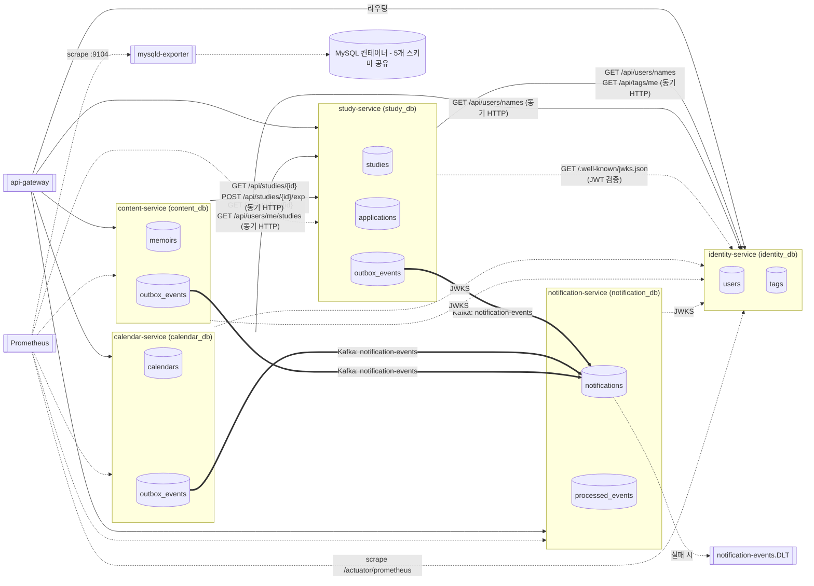

# Groovy MSA DB 관계도

> 이 문서는 "지금 DB가 실제로 어떻게 나뉘어 있고 서로 어떻게 참조하는지"를 정리한다. 구조/실행
> 전반은 [`Groovy_MSA_구조와실행.md`](./Groovy_MSA_구조와실행.md), 저장소 파일 구조는
> [`Groovy_MSA_저장소_구조.md`](./Groovy_MSA_저장소_구조.md) 참고. 스키마 정의는
> `backend/services/*/src/main/resources/db/migration/*.sql`(Flyway)이 원본이고, 이 문서는
> 그걸 사람이 읽기 좋게 정리한 것이다 — 스키마가 바뀌면 이 문서도 함께 갱신해야 한다.

## 1. 개요

5개 서비스가 MySQL 컨테이너 **하나** 안에 있는 스키마(데이터베이스) 5개를 각자 소유한다
(`mysql-init/*.sql`이 컨테이너 최초 기동 시 스키마+전용 계정을 만든다). 컨테이너는 하나지만
계정 권한이 완전히 분리되어 있어 "물리적으로 같은 서버, 논리적으로는 서로 접근 불가능한
DB"다.

| 서비스 | DB(스키마)명 | 전용 계정 | 다른 서비스 DB 접근 권한 |
|---|---|---|---|
| identity-service | `identity_db` | `identity_service` | 없음(`identity_db`에만 `GRANT ALL`) |
| study-service | `study_db` | `study_service` | 없음 |
| calendar-service | `calendar_db` | `calendar_service` | 없음 |
| content-service | `content_db` | `content_service` | 없음 |
| notification-service | `notification_db` | `notification_service` | 없음 |

각 서비스의 `application.yml`이 자기 계정으로만 접속하므로, **다른 서비스의 DB는 코드
레벨에서 SQL로 절대 조회할 수 없다** — cross-schema JOIN이 계정 권한 단계에서부터 물리적으로
막혀 있다. 대신 다른 서비스의 데이터가 필요하면 2번(동기 HTTP) 또는 이벤트(비동기 Kafka)로만
접근한다.

## 2. 서비스별 DB 상세

컬럼 중 다른 서비스의 PK를 값으로만 들고 있는(=FK 제약 없이 ID만 저장) 컬럼은 **"서비스 간
참조"**로 표시한다. 실제 FK 제약(`CONSTRAINT ... FOREIGN KEY`)은 같은 DB 안의 테이블끼리만
걸려 있다.

### 2.1 `identity_db` (identity-service) — 신원/인증/태그 정본

| 테이블 | 역할 | 주요 컬럼 | 관계 |
|---|---|---|---|
| `users` | 회원 | `id` PK, `email`(unique), `name`, `password`, `provider_type`(GOOGLE/KAKAO/LOCAL), `role_type`(ADMIN/USER) | 다른 4개 DB가 이 `id`를 값으로만 참조(서비스 간 참조, FK 없음) |
| `tags` | 태그 마스터(정본) | `id` PK, `category`(OPERATING_POLICY/STUDY_MODE), `name`(unique) | `user_tags`가 FK로 참조. **study_db에도 이름이 같은 사본 테이블이 있음**(2.2 참고) |
| `user_tags` | 회원별 선호 태그(관계 테이블) | `id` PK, `user_id` FK→`users.id`, `tag_id` FK→`tags.id`, unique(`user_id`,`tag_id`) | `identity_db` 안에서만 완결되는 다대다 관계 테이블 |

### 2.2 `study_db` (study-service) — 스터디/신청/대기열

| 테이블 | 역할 | 주요 컬럼 | 관계 |
|---|---|---|---|
| `studies` | 스터디 | `id` PK, `title`, `description`, `capacity`, `level`, `exp_point`, `leader_id` | `leader_id` → **identity_db.users.id**(서비스 간 참조, FK 없음) |
| `applications` | 참여 신청 | `id` PK, `study_id` FK→`studies.id`, `applicant_id`, `status`(PENDING/APPROVED/REJECTED), unique(`study_id`,`applicant_id`) | `applicant_id` → **identity_db.users.id**(서비스 간 참조) |
| `study_meeting_days` | 스터디 모임 요일(관계 테이블) | `study_id` FK→`studies.id`, `day_of_week`, PK(`study_id`,`day_of_week`) | `study_db` 안에서만 완결 |
| `study_tags` | 스터디-태그 매핑(관계 테이블) | `id` PK, `study_id` FK→`studies.id`, `tag_id` FK→`tags`(**study_db 로컬 사본**), unique(`study_id`,`tag_id`) | `study_db` 안에서만 완결(단, 참조 대상 `tags`가 사본이라는 점은 아래 참고) |
| `tags` | 태그 **사본**(Shared Kernel) | identity_db.tags와 컬럼 동일 | identity_db가 정본을 소유하고, study_db는 FK 무결성 목적의 로컬 사본을 별도로 관리한다. **실시간 동기화 메커니즘이 없다**(수동 시드 필요 — 알려진 한계, `docs/Groovy_MSA_구조와실행.md` §6 참고) |
| `study_waitlists` | 대기열 | `id` PK, `study_id` FK→`studies.id`, `user_id`, unique(`study_id`,`user_id`) | `user_id` → **identity_db.users.id**(서비스 간 참조) |
| `outbox_events` | Transactional Outbox | `id` PK, `event_id`(unique), `event_type`, `payload`(JSON 문자열), `published`, `published_at` | Kafka로 발행되는 큐 — 4번(통신 방법) 참고 |

### 2.3 `calendar_db` (calendar-service) — 개인 일정/스터디 약속

| 테이블 | 역할 | 주요 컬럼 | 관계 |
|---|---|---|---|
| `calendars` | 일정 | `id` PK, `title`, `content`, `date`, `end_date`, `user_id`, `study_id`(nullable) | `user_id` → **identity_db.users.id**, `study_id` → **study_db.studies.id**(둘 다 서비스 간 참조, FK 없음) |
| `outbox_events` | Transactional Outbox | study_db와 동일 구조 | Kafka로 발행 |

### 2.4 `content_db` (content-service) — 회고록/댓글/좋아요

| 테이블 | 역할 | 주요 컬럼 | 관계 |
|---|---|---|---|
| `memoirs` | 회고록 | `id` PK, `title`, `content`, `study_id`, `author_id` | `study_id` → **study_db.studies.id**, `author_id` → **identity_db.users.id**(서비스 간 참조) |
| `memoir_comments` | 댓글 | `id` PK, `memoir_id` FK→`memoirs.id`, `content`, `author_id` | `author_id` → **identity_db.users.id**(서비스 간 참조). `memoir_id`는 같은 DB 내 FK |
| `memoir_likes` | 좋아요 | `id` PK, `memoir_id` FK→`memoirs.id`, `user_id`, unique(`memoir_id`,`user_id`) | `user_id` → **identity_db.users.id**(서비스 간 참조) |
| `outbox_events` | Transactional Outbox | study_db와 동일 구조 | Kafka로 발행 |

### 2.5 `notification_db` (notification-service) — 알림 저장 + 이벤트 소비 Inbox

| 테이블 | 역할 | 주요 컬럼 | 관계 |
|---|---|---|---|
| `notifications` | 알림 | `id` PK, `recipient_id`, `type`, `title`, `message`, `target_id`(nullable), `is_read`, `read_at` | `recipient_id` → **identity_db.users.id**(서비스 간 참조). `target_id`는 알림이 가리키는 대상(스터디/회고록 등) PK를 도메인 구분 없이 저장 — 어느 서비스의 PK인지는 `type`으로만 구분됨(느슨한 참조) |
| `processed_events` | Inbox(멱등성) | `event_id` PK(varchar 36) | study/calendar/content-service의 `outbox_events.event_id`와 **같은 값**이 Kafka를 거쳐 여기 기록된다(3번/4번 항목에서 정리한 `EventEnvelope.eventId`) — DB 레벨 FK가 아니라 메시지 페이로드로 연결되는 비동기 상관관계(correlation) |

## 3. DB 간 관계 요약 (서비스 간 참조, 전부 FK 없음)

```
identity_db.users.id
  ← study_db.studies.leader_id
  ← study_db.applications.applicant_id
  ← study_db.study_waitlists.user_id
  ← calendar_db.calendars.user_id
  ← content_db.memoirs.author_id
  ← content_db.memoir_comments.author_id
  ← content_db.memoir_likes.user_id
  ← notification_db.notifications.recipient_id

study_db.studies.id
  ← calendar_db.calendars.study_id
  ← content_db.memoirs.study_id

identity_db.tags  ⇢ (수동 시드, 실시간 동기화 없음) ⇢  study_db.tags(로컬 사본)
```

모든 화살표는 "값만 저장하고 DB 레벨 무결성 보장은 없음"을 뜻한다. 정합성은 전부
애플리케이션 레벨(동기 조회 시점의 존재 확인, 또는 Outbox/Inbox를 통한 최종 일관성)에서만
유지된다 — 예를 들어 study-service에서 스터디를 삭제해도 calendar_db.calendars.study_id나
content_db.memoirs.study_id가 자동으로 정리되지 않는다(참조 무결성이 DB 레벨에 없으므로).

## 4. 다른 DB(서비스) 접근 방법 — API/네트워크 통신

DB를 직접 조회할 방법이 없으므로, 다른 서비스가 가진 데이터가 필요하면 아래 두 가지 중
하나로만 접근한다.

### 4.1 동기 HTTP (요청-응답이 즉시 필요한 경우)

`RestClient` + `ResilientCallExecutor`(CircuitBreaker+Retry, 8번 항목에서 도입)로 호출한다.
전부 원 요청의 `Authorization` 헤더를 그대로 전달(forward)해서 호출 대상 서비스가 직접
JWT를 검증한다.

| 호출자 | 대상 | 엔드포인트 | 용도 |
|---|---|---|---|
| study-service, content-service | identity-service | `GET /api/users/names?ids=...` | 표시용 이름 배치 조회(`libs:client-common`의 공유 `UserServiceClient`) |
| study-service | identity-service | `GET /api/tags/me` | 태그 매칭 조회 시 로그인 유저의 선호 태그 대체값(`TagPreferenceClient`) |
| calendar-service, content-service | study-service | `GET /api/studies/{id}` | 스터디 상세 + 멤버십 확인(`myApplicationStatus`) |
| content-service | study-service | `GET /api/studies/summary?ids=...` | 회고록에 스터디 제목/레벨/경험치 배치 표시 |
| content-service | study-service | `POST /api/studies/{id}/exp` | 회고록/댓글 작성 시 경험치 적립(부가 효과, 실패해도 본 동작은 유지) |
| calendar-service, content-service | study-service | `GET /api/users/me/studies`, `GET /api/users/me/applications` | "내가 방장/승인된 스터디" 옵션 목록 조합 |
| study-service, calendar-service, content-service, notification-service | identity-service | `GET /.well-known/jwks.json` | JWT 서명 검증용 공개키(`libs:security-common`의 `JwksKeyLocator`) — 데이터 조회는 아니지만 서비스 간 유일한 신뢰 기반 |

### 4.2 비동기 Kafka (Transactional Outbox → Inbox, 최종 일관성이면 충분한 경우)

study/calendar/content-service가 발행자, notification-service가 유일한 소비자다.

1. 발행 서비스가 자기 도메인 트랜잭션 안에서 자기 DB의 `outbox_events`에 이벤트를 기록한다
   (`OutboxEventWriter`, `EventEnvelope` — 3번 항목에서 `event-contract`로 통합).
2. `OutboxRelay`(`@Scheduled`, 1초 주기)가 미발행 레코드를 읽어 Kafka 토픽
   `notification-events`(SASL_PLAINTEXT)로 발행하고 `published=true`로 표시한다.
3. notification-service의 `NotificationEventConsumer`(`@KafkaListener`)가 소비 → 자기 DB의
   `notifications`에 저장 + `processed_events`(Inbox)에 기록해 멱등 처리 → SSE로 실시간 푸시.
4. 역직렬화 실패 등 재시도해도 실패할 메시지는 `notification-events.DLT`로 보낸다(4번 항목).

```
study-service ─┐
calendar-service ├─(Kafka: notification-events)─▶ notification-service ─▶ SSE(브라우저)
content-service ─┘                                       │
                                                    실패 시 → notification-events.DLT
```

### 4.3 API Gateway를 통한 외부 노출

`api-gateway`가 모든 외부 요청의 단일 진입점이며 경로별로 각 서비스에 프록시한다. 다만
`Path=/api/studies/**`처럼 와일드카드 라우트가 걸려 있어, 4.1의 "서비스 간 전용" 엔드포인트
(`/api/studies/{id}/members`, `/api/studies/summary`, `/api/studies/{id}/exp`)도 게이트웨이를
거쳐 **외부에서 직접 호출 가능**하다 — 10번 항목(심층방어)에서 이미 확인한 내용.

## 5. 모니터링 스택에서 관측하는 DB 지표

### 5.1 수집되는 지표

| 출처 | Prometheus job | 무엇을 보는가 | 단위 |
|---|---|---|---|
| `mysqld-exporter`(→ 공유 MySQL 컨테이너 하나) | `mysql` | `mysql_global_status_*`(Threads_connected, Questions, Slow_queries 등), `mysql_global_variables_*`, `mysql_up` | **인스턴스 전체 단위** — 5개 스키마가 한 컨테이너에 있어서 스키마별로 쪼개서 보는 수집 플래그(`--collect.info_schema.tables` 등)는 켜져 있지 않다. 즉 "study_db만 느리다" 같은 스키마 단위 구분은 지금 지표로는 안 된다 |
| 각 서비스의 `/actuator/prometheus`(Micrometer HikariCP 바인더) | `identity-service`/`study-service`/`content-service`/`calendar-service`/`notification-service` | `hikaricp_connections_active`/`idle`/`pending`/`max`/`min`, `hikaricp_connections_acquire_seconds`, `hikaricp_connections_usage_seconds` | **서비스(=DB) 단위**로 정확히 분리됨 — `job` 라벨로 어느 서비스의 커넥션 풀인지 구분 가능 |

### 5.2 알림(Alertmanager)

`monitoring-msa/prometheus/alert.rules.yml`(5번 항목에서 정비):

- `HikariCpuPoolPendingDetected`: `sum by (job) (hikaricp_connections_pending) > 0` — 서비스별로
  커넥션을 못 받고 대기 중인 스레드가 있으면 즉시(1분 지속) 알림.
- `BackendMemoryUsageTooHigh`: JVM 힙(간접적으로 DB 커넥션 처리 여유와 연관) 40% 초과 시 알림.

### 5.3 대시보드 — 현재 비어 있는 영역

Grafana에 프로비저닝된 대시보드는 `backend-app-logs-dashboard.json`(Loki 로그)와
`springboot-dashboard.json`(9번 항목에서 스키마 수정, "JVM (Micrometer)")뿐이다. **두 대시보드
모두 HikariCP/MySQL 관련 패널이 하나도 없다** — 패널 제목/쿼리를 전수 확인한 결과
`hikaricp_*`/`mysql_global_*` 지표를 참조하는 패널이 0개였다. 즉 DB 지표는 **Prometheus에
수집은 되고 있지만 Grafana에서 시각화되고 있지는 않다** — Prometheus Explore나 Alertmanager
알림으로만 확인 가능한 상태다. 대시보드 패널 추가는 이번 문서화 범위 밖이라 진행하지 않았다.

## 6. 전체 ERD

### 6.1 테이블/관계 (Mermaid ER Diagram)

DB 경계는 엔티티 이름 접두사(`identity_`/`study_`/`calendar_`/`content_`/`notification_`)로
구분했다. 실선 관계는 전부 "값 참조"이며, 같은 DB 내부 관계만 실제 FK 제약이다(§2의 표에서
FK 여부를 확인할 것) — Mermaid ER 문법은 FK 유무를 선으로 구분하지 못해 관계 라벨 텍스트로
표시했다.

```mermaid
erDiagram
    identity_users {
        bigint id PK
        varchar email UK
        varchar name
        varchar password
        enum provider_type
        enum role_type
    }
    identity_tags {
        bigint id PK
        enum category
        varchar name UK
    }
    identity_user_tags {
        bigint id PK
        bigint user_id FK
        bigint tag_id FK
    }
    identity_users ||--o{ identity_user_tags : "FK (같은 DB)"
    identity_tags ||--o{ identity_user_tags : "FK (같은 DB)"

    study_studies {
        bigint id PK
        varchar title
        int capacity
        int level
        int exp_point
        bigint leader_id "서비스 간 참조"
    }
    study_applications {
        bigint id PK
        bigint study_id FK
        bigint applicant_id "서비스 간 참조"
        enum status
    }
    study_meeting_days {
        bigint study_id FK
        enum day_of_week
    }
    study_tags_local {
        bigint id PK
        enum category
        varchar name UK
    }
    study_study_tags {
        bigint id PK
        bigint study_id FK
        bigint tag_id FK
    }
    study_waitlists {
        bigint id PK
        bigint study_id FK
        bigint user_id "서비스 간 참조"
    }
    study_outbox_events {
        bigint id PK
        varchar event_id UK
        varchar event_type
        text payload
        boolean published
    }
    study_studies ||--o{ study_applications : "FK (같은 DB)"
    study_studies ||--o{ study_meeting_days : "FK (같은 DB)"
    study_studies ||--o{ study_study_tags : "FK (같은 DB)"
    study_tags_local ||--o{ study_study_tags : "FK (같은 DB)"
    study_studies ||--o{ study_waitlists : "FK (같은 DB)"
    identity_tags ||--o{ study_tags_local : "수동 시드, 실시간 동기화 없음"

    calendar_calendars {
        bigint id PK
        varchar title
        date date
        bigint user_id "서비스 간 참조"
        bigint study_id "서비스 간 참조, nullable"
    }
    calendar_outbox_events {
        bigint id PK
        varchar event_id UK
        varchar event_type
        text payload
        boolean published
    }

    content_memoirs {
        bigint id PK
        varchar title
        bigint study_id "서비스 간 참조"
        bigint author_id "서비스 간 참조"
    }
    content_memoir_comments {
        bigint id PK
        bigint memoir_id FK
        bigint author_id "서비스 간 참조"
    }
    content_memoir_likes {
        bigint id PK
        bigint memoir_id FK
        bigint user_id "서비스 간 참조"
    }
    content_outbox_events {
        bigint id PK
        varchar event_id UK
        varchar event_type
        text payload
        boolean published
    }
    content_memoirs ||--o{ content_memoir_comments : "FK (같은 DB)"
    content_memoirs ||--o{ content_memoir_likes : "FK (같은 DB)"

    notification_notifications {
        bigint id PK
        bigint recipient_id "서비스 간 참조"
        varchar type
        bigint target_id "느슨한 참조, nullable"
        boolean is_read
    }
    notification_processed_events {
        varchar event_id PK
    }

    identity_users ||--o{ study_studies : "서비스 간 참조 (leader_id)"
    identity_users ||--o{ study_applications : "서비스 간 참조 (applicant_id)"
    identity_users ||--o{ study_waitlists : "서비스 간 참조 (user_id)"
    identity_users ||--o{ calendar_calendars : "서비스 간 참조 (user_id)"
    identity_users ||--o{ content_memoirs : "서비스 간 참조 (author_id)"
    identity_users ||--o{ content_memoir_comments : "서비스 간 참조 (author_id)"
    identity_users ||--o{ content_memoir_likes : "서비스 간 참조 (user_id)"
    identity_users ||--o{ notification_notifications : "서비스 간 참조 (recipient_id)"
    study_studies ||--o{ calendar_calendars : "서비스 간 참조 (study_id)"
    study_studies ||--o{ content_memoirs : "서비스 간 참조 (study_id)"
    study_outbox_events ||--o| notification_processed_events : "Kafka 상관관계 (event_id)"
    calendar_outbox_events ||--o| notification_processed_events : "Kafka 상관관계 (event_id)"
    content_outbox_events ||--o| notification_processed_events : "Kafka 상관관계 (event_id)"
```



### 6.2 서비스 간 통신 흐름 (Mermaid Flowchart)


