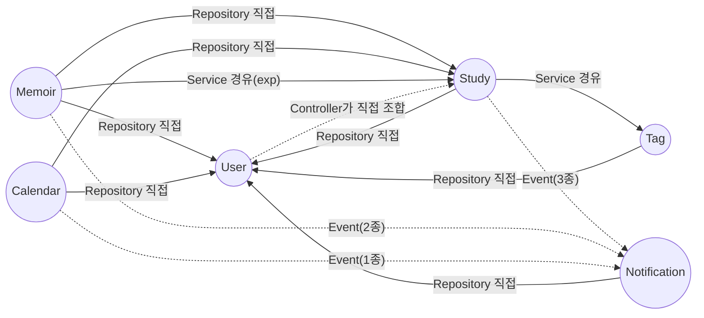

# Groovy MSA 전환 — Phase 0: 의존성 전수 조사

> 상위 계획: [`Groovy_MSA_전환계획.md`](./Groovy_MSA_전환계획.md) Phase 0
> 목표: 코드를 건드리기 전에 현재 결합도를 눈에 보이게 만든다.
> 조사 범위: `groovy/src/main/java/com/groovy/backend/domain/{study,user,memoir,calendar,notification,tag}` 전체 Service/Controller 13개
> 조사 방법: 각 Service 클래스의 실제 import·주입 필드·트랜잭션 경계·이벤트 발행/구독을 코드 레벨에서 직접 확인 (정적 분석 기반, 실행/추정 아님)

---

## 1. 도메인별 의존성 표

### 1.1 Study 도메인

```
Domain: Study
Service: StudyService
├─ 사용 Entity: Study(own), User(cross-read: leader/viewer), Application(cross-read: 멤버 수·상태 집계)
├─ 사용 Repository: StudyRepository, ApplicationRepository(cross), UserRepository(cross)
├─ 다른 Domain Service 호출: TagService.replaceStudyTags/getStudyTagIds*/getUserTagIds/getMatchedStudyIds(cross)
│                          WaitlistService.isRegistered/findRecipientUserIds(같은 study 패키지, 다른 Service)
├─ 발행 이벤트: WaitlistSeatOpenedEvent, StudyLevelUpEvent → notification (ApplicationEventPublisher)
├─ Transaction 범위:
│   - createStudy(): Study insert + StudyTag 전체 교체
│   - updateStudy(): Study update + StudyTag 교체 + (정원 재개방 시) 이벤트 발행
│   - addExpAndNotifyLevelUp(): Study.exp/level update + 이벤트 발행 (Memoir/MemoirComment가 호출)
│   - deleteStudy(): Application 전체 삭제 + StudyTag 전체 삭제 + Study 삭제 (3개 테이블 한 트랜잭션)
├─ Redis 사용: 없음
└─ 제공 API: POST /api/studies, GET /api/studies, GET /api/studies/{id}, GET /api/studies/match,
             PUT /api/studies/{id}, DELETE /api/studies/{id}

Service: ApplicationService
├─ 사용 Entity: Application(own), Study(cross-read), User(cross-read)
├─ 사용 Repository: ApplicationRepository, UserRepository(cross)
├─ 다른 Domain Service 호출: StudyService.getStudyEntity/getStudyEntityForUpdate/validateLeader
│                          WaitlistService.findRecipientUserIds/removeIfRegistered
├─ 발행 이벤트: ApplicationSubmittedEvent, ApplicationDecidedEvent, WaitlistSeatOpenedEvent → notification
├─ Transaction 범위:
│   - apply(): Application insert/reapply + 이벤트 발행
│   - leave(): Study 비관적 락 + Application delete + 이벤트 발행 (탈퇴 하나가 Study+Application 동시에 걸침)
│   - updateStatus(): Study 비관적 락 + Application 상태 변경 + Waitlist 제거 + 이벤트 발행
│                     → 승인 처리 1건이 Study·Application·Waitlist 3개 테이블 + (비동기)Notification까지 연쇄
├─ Redis 사용: 없음
└─ 제공 API: POST/DELETE/GET /api/studies/{studyId}/applications, PATCH .../applications/{id},
             DELETE /api/studies/{studyId}/membership (leave)

Service: WaitlistService
├─ 사용 Entity: StudyWaitlist(own), Study(cross-read), User(cross-read)
├─ 사용 Repository: WaitlistRepository, ApplicationRepository(cross), UserRepository(cross),
│                   StudyRepository(cross — 코드 주석: StudyService를 쓰면 updateStudy↔WaitlistService
│                   순환 의존이 생겨 의도적으로 Repository를 직접 참조)
├─ 다른 Domain Service 호출: 없음
├─ 발행 이벤트: 없음 (호출자인 StudyService/ApplicationService가 발행)
├─ Transaction 범위: register/cancel/removeIfRegistered 각각 단일 테이블
├─ Redis 사용: 없음
└─ 제공 API: POST/DELETE /api/studies/{studyId}/waitlist
```

### 1.2 User 도메인

```
Domain: User
Service: UserService
├─ 사용 Entity: User(own)
├─ 사용 Repository: UserRepository
├─ 다른 Domain Service 호출: 없음 (TokenProvider는 global/auth, 도메인 서비스 아님)
├─ 발행 이벤트: 없음
├─ Transaction 범위: signup()(User insert 단일), login()(읽기전용, DB 쓰기 없음 — JWT 발급만)
├─ Redis 사용: 없음
└─ 제공 API: POST /api/auth/signup, POST /api/auth/login, POST /api/auth/logout, GET /api/users/me

Controller (전용 Service 없이 직접 조합): UserController
├─ 다른 Domain Service 직접 주입: StudyService, ApplicationService (cross)
├─ 제공 API: GET /api/users/me/studies → StudyService.getMyStudies()
│            GET /api/users/me/applications → ApplicationService.getMyApplications()
└─ 비고: 이 프로젝트에서 유일하게 "Controller 계층에서의 cross-domain 직접 조합" 패턴.
         Service 대 Service가 아니라 User의 Controller가 Study 도메인 Service 2개를 바로 주입받음.
```

### 1.3 Memoir 도메인

```
Domain: Memoir
Service: MemoirService
├─ 사용 Entity: Memoir/MemoirLike(own), Study(cross-read), Application(cross-read), User(cross-read)
├─ 사용 Repository: MemoirRepository, MemoirCommentRepository, MemoirLikeRepository,
│                   StudyRepository(cross), ApplicationRepository(cross), UserRepository(cross)
├─ 다른 Domain Service 호출: StudyService.addExpAndNotifyLevelUp(cross)
├─ 발행 이벤트: MemoirLikeAddedEvent → notification
├─ Transaction 범위:
│   - createMemoir(): Memoir insert + Study.exp update(cross) + (레벨업 시) 이벤트 발행
│   - deleteMemoir(): MemoirComment 전체 삭제 + MemoirLike 전체 삭제 + Memoir 삭제
│   - likeMemoir/unlikeMemoir(): MemoirLike insert/delete + 이벤트 발행
├─ Redis 사용: 없음
└─ 제공 API: POST/GET/GET(my-studies)/GET(mine)/GET({id})/PUT/DELETE /api/memoirs*,
             POST/DELETE /api/memoirs/{id}/likes

Service: MemoirCommentService
├─ 사용 Entity: MemoirComment(own), Memoir(같은 도메인, MemoirService 경유), User(cross-read)
├─ 사용 Repository: MemoirCommentRepository, UserRepository(cross)
├─ 다른 Domain Service 호출: MemoirService.getMemoirEntity(같은 도메인),
│                          StudyService.addExpAndNotifyLevelUp(cross)
├─ 발행 이벤트: MemoirCommentAddedEvent → notification
├─ Transaction 범위: createComment(): MemoirComment insert + Study.exp update(cross) + 이벤트 발행
├─ Redis 사용: 없음
└─ 제공 API: GET/POST /api/memoirs/{memoirId}/comments, PUT/DELETE .../comments/{commentId}
```

### 1.4 Calendar 도메인

```
Domain: Calendar
Service: CalendarService
├─ 사용 Entity: Calendar(own), Study(cross-read), Application(cross-read), User(cross-read)
├─ 사용 Repository: CalendarRepository, ApplicationRepository(cross), StudyRepository(cross),
│                   UserRepository(cross)
├─ 다른 Domain Service 호출: 없음 — Study/Application/User를 전부 Repository로 직접 접근하고
│                          StudyService/ApplicationService는 한 번도 경유하지 않음 (Phase 1 리팩터링 1순위)
├─ 발행 이벤트: StudyScheduleChangedEvent → notification
├─ Transaction 범위: addSchedule/updateSchedule/deleteSchedule 각각 Calendar 단일 테이블
│                    + (스터디 일정인 경우) 이벤트 발행
├─ Redis 사용: 없음
└─ 제공 API: GET/POST /api/calendars, GET /api/calendars/studies, GET/PUT/DELETE /api/calendars/{id}
```

### 1.5 Tag 도메인

```
Domain: Tag
Service: TagService
├─ 사용 Entity: Tag/UserTag/StudyTag(own), Study(cross — replaceStudyTags(Study, ...) 파라미터로만 수신,
│               Repository는 직접 안 씀), User(cross-read)
├─ 사용 Repository: TagRepository, UserTagRepository, StudyTagRepository, UserRepository(cross)
├─ 다른 Domain Service 호출: 없음
├─ 발행 이벤트: 없음
├─ Transaction 범위: updateUserTags/replaceStudyTags/deleteStudyTags 각각 diff 기반 delete+insert
├─ Redis 사용: 없음
└─ 제공 API: GET /api/tags, GET/PUT /api/tags/me
             (+ StudyService가 내부적으로 태그 매칭·부착 로직을 호출하는 형태로 간접 관여)
```

### 1.6 Notification 도메인

```
Domain: Notification
Service: NotificationService
├─ 사용 Entity: Notification(own), User(cross-read — recipient 조회, 로그인 사용자 조회)
├─ 사용 Repository: NotificationRepository, UserRepository(cross)
├─ 다른 Domain Service 호출: 없음 — 나가는 의존성이 없는 leaf 서비스
├─ 수신 이벤트: 7종 전부 (아래 참고) — 직접 호출이 아니라 NotificationEventListener를 통해서만 트리거됨
├─ Transaction 범위: createAndPublish(): Notification insert 단일.
│                    원본 트랜잭션(Study/Memoir/Calendar 쪽)과는 물리적으로 분리된 트랜잭션
│                    (AFTER_COMMIT + @Async라, 원본이 롤백되면 애초에 이 메서드가 호출되지 않음)
├─ Redis 사용: 있음
│   - Pub/Sub 브로드캐스트: channel="notifications", 멀티 인스턴스 SSE 팬아웃용
│   - 1회성 구독 티켓: key="notification:subscribe-ticket:{ticket}", TTL 30초
└─ 제공 API: GET /api/notifications, POST /api/notifications/{id}/read,
             POST /api/notifications/read-all, POST /api/notifications/subscribe-ticket,
             GET /api/notifications/subscribe (SSE)

Component(인프라): NotificationEventListener
├─ 다른 Domain Service 호출: NotificationService.createAndPublish (같은 도메인)
├─ 수신 이벤트(발행처):
│   - ApplicationSubmittedEvent, ApplicationDecidedEvent, WaitlistSeatOpenedEvent ← study
│   - StudyLevelUpEvent ← study (Memoir/MemoirComment가 간접 트리거)
│   - MemoirCommentAddedEvent, MemoirLikeAddedEvent ← memoir
│   - StudyScheduleChangedEvent ← calendar
├─ 처리 방식: @TransactionalEventListener(AFTER_COMMIT) + @Async("notificationTaskExecutor")
└─ 제공 API: 없음 (이벤트 리스너)

Component(인프라): NotificationRedisSubscriber
├─ Redis 사용: 있음 — Pub/Sub 채널 구독자, 메시지 수신 시 NotificationService.pushToLocalEmitters 호출
└─ 다른 Domain Service 호출: NotificationService (같은 도메인)

Component(인프라): NotificationCleanupScheduler
├─ 사용 Repository: NotificationRepository
├─ Transaction 범위: 매일 03:00 cron — 안읽음 7일 경과분 삭제, 읽음 3일 경과분 삭제 (각각 별도 트랜잭션)
└─ 다른 도메인 의존: 없음
```

---

## 2. Cross-domain Repository/Entity 직접 접근 목록

계획서 완료 기준에서 요구한 "눈에 보이는 목록"입니다. **Service 경유(⚠ 경고 수준)** 와 **Repository/Entity 직접 접근(🔴 위험 수준)** 을 구분했습니다.

| 호출 도메인 | 접근 대상 | 접근 유형 | 접근 지점(Service) |
|---|---|---|---|
| Study | UserRepository, User | 🔴 Repository 직접 | StudyService, ApplicationService, WaitlistService |
| Study | TagService | ⚠ Service 경유 | StudyService |
| Memoir | StudyRepository, Study | 🔴 Repository 직접 | MemoirService |
| Memoir | ApplicationRepository, Application | 🔴 Repository 직접 | MemoirService |
| Memoir | UserRepository, User | 🔴 Repository 직접 | MemoirService, MemoirCommentService |
| Memoir | StudyService | ⚠ Service 경유 | MemoirService, MemoirCommentService (addExpAndNotifyLevelUp) |
| Calendar | StudyRepository, Study | 🔴 Repository 직접 | CalendarService |
| Calendar | ApplicationRepository, Application | 🔴 Repository 직접 | CalendarService |
| Calendar | UserRepository, User | 🔴 Repository 직접 | CalendarService |
| Notification | UserRepository, User | 🔴 Repository 직접 | NotificationService |
| Tag | UserRepository, User | 🔴 Repository 직접 | TagService |
| Tag | Study (타입 파라미터만) | ⚠ 약한 결합 | TagService.replaceStudyTags(Study, …) |
| User(Controller) | StudyService, ApplicationService | ⚠ Service 경유 (단, Controller 계층) | UserController |
| Study(WaitlistService) | StudyRepository | 🔴 Repository 직접 (같은 도메인 내 순환 의존 회피용) | WaitlistService |

**요약**: 6개 도메인 중 **Notification만 나가는 cross-domain 의존이 0**입니다. 나머지 5개 도메인은 예외 없이 `UserRepository`를 직접 참조하고 있어, User는 사실상 "모두가 직접 찌르는 공용 참조 테이블"이 되어 있습니다. `Memoir`, `Calendar`는 `Study`의 Repository까지 직접 열어 쓰고 있어 Phase 1에서 가장 먼저 손봐야 할 지점입니다.

---

## 3. Coupling Graph



- **실선** = 동기 직접 참조(Repository/Entity 직접 접근 또는 Service 메서드 호출)
- **점선** = 비동기 이벤트 발행(Spring `ApplicationEvent`, 느슨한 결합)

관찰:
- `User`는 5개 도메인 모두로부터 직접 참조당하는 **최대 결합 지점(hub)** 입니다. MSA 전환 시 identity-service 추출은 5곳의 참조를 전부 API 호출로 바꿔야 하는, Notification보다 훨씬 큰 작업입니다.
- `Study`는 `Memoir`, `Calendar`로부터 직접 참조당하는 두 번째 결합 지점입니다.
- `Notification`은 들어오는 화살표가 전부 점선(이벤트)이고 나가는 화살표는 `User` 하나뿐입니다 — 계획서(Phase 6)가 Notification을 첫 추출 대상으로 삼은 근거가 코드 레벨에서도 확인됩니다.
- `User → Study` 방향의 점선(Controller 조합)은 이벤트가 아니라 **Controller 계층에서의 즉시 동기 호출**이라 실제로는 강결합이며, 표기상 별도로 구분해뒀습니다(그래프에서는 대시 처리했지만 성격은 실선에 가깝습니다).

---

## 4. Phase 1 진입을 위한 시사점

Phase 0는 조사만 하고 코드는 건드리지 않는 단계이므로, 아래는 다음 Phase(Modular Monolith 전환)에서 그대로 쓸 수 있는 입력값입니다.

1. **금지 규칙 후보 (계획서 Phase 1 "코드 리뷰 체크리스트"에 바로 반영 가능)**
   ```
   Study(WaitlistService 제외) → UserRepository 직접 접근 금지 → UserService 공개 API 경유
   Memoir → StudyRepository/ApplicationRepository 직접 접근 금지 → StudyService 공개 API 경유
   Calendar → StudyRepository/ApplicationRepository 직접 접근 금지 → StudyService 공개 API 경유
   Notification → UserRepository 직접 접근 금지 → UserService 공개 API 경유
   Tag → UserRepository 직접 접근 금지 → UserService 공개 API 경유
   ```
2. **가장 시급한 리팩터링 대상**: `CalendarService`. Study/Application/User 3개 도메인을 전부 Repository로 직접 접근하며 Service 계층을 한 번도 거치지 않습니다. `MemoirService`도 동일 패턴(Study/Application Repository 직접 접근)을 갖고 있습니다.
3. **의도적 예외를 문서화해 둘 것**: `WaitlistService`가 `StudyRepository`를 직접 쓰는 것은 실수가 아니라 `StudyService ↔ WaitlistService` 순환 의존을 피하기 위한 설계 선택입니다(코드 주석에 이미 명시됨). Modular Monolith 규칙을 넣을 때 이 케이스를 예외로 등록하거나, `StudyService`의 락 조회 메서드를 별도 읽기 전용 컴포넌트로 뽑아 순환을 근본적으로 없애는 방향을 검토해야 합니다.
4. **User 도메인은 Notification보다 훨씬 큰 작업**: Phase 6(Notification 추출) 이후 Phase 순서상 Identity(User) 추출이 이어지는데, 위 결합도 그래프대로면 User는 5개 도메인 전부가 직접 참조하는 허브라 Notification 추출보다 범위가 훨씬 넓습니다. Phase 1에서 `UserRepository` 직접 접근부터 걷어내는 작업이 이후 Identity 서비스 추출 난이도를 실질적으로 좌우합니다.
5. **UserController의 조합 책임**: `/api/users/me/studies`, `/api/users/me/applications`는 User가 아니라 Study 도메인 데이터를 반환하는 API입니다. 서비스 분리 후 이 엔드포인트를 (a) API Gateway에서 조합할지, (b) User(identity) 서비스가 Study 서비스를 내부 API로 호출할지, (c) 프론트가 두 번 호출하도록 바꿀지 Phase 2(Contract 정의)에서 결정이 필요합니다.

---

## 5. 완료 기준 체크

- [x] 6개 도메인(Study/User/Memoir/Calendar/Notification/Tag)의 의존성 표 작성 완료 — §1 (Study/Memoir는 서비스 단위로 세분화하여 총 13개 Service/Component 전수 조사)
- [x] "cross-domain repository 직접 접근" 목록이 눈에 보이는 문서로 정리됨 — §2, §3
